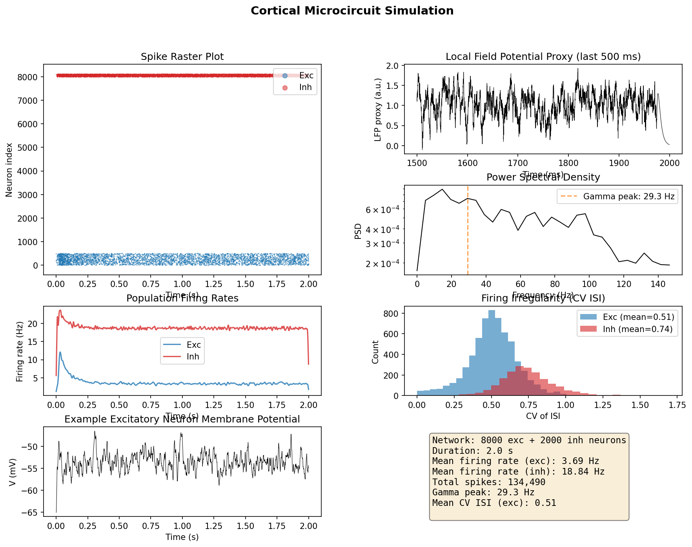

# braintest

I wanted to understand how brain simulations work, specifically how to split computation between a CPU and GPU so you can simulate more neurons on a laptop.

## What I did

I built a spiking neural network simulator that runs 10,000 AdEx neurons: 8,000 excitatory, 2,000 inhibitory, 2% random connectivity. The key idea is keeping the wiring map (sparse matrices, ~24 MB at 10K neurons) on the CPU and the neuron state (~200 bytes/neuron) on the GPU. Each timestep, only the spike indices get sent back and forth. This means you can scale to 50K+ neurons without blowing up GPU memory.

The network settles into an asynchronous irregular state with emergent gamma oscillations (~30 Hz), which is what real cortex does.

## How to run

```bash
pip install numpy matplotlib scipy pyyaml torch

python src/run_simulation.py                                    # 10K neurons, 2s
python src/run_simulation.py --n_neurons 25000 --duration 1.0   # bigger network
python src/run_simulation.py --no-plot                          # skip figures
```

On my laptop (GTX 1650 Max-Q), 10K neurons takes ~65-87s and 50K takes ~99 minutes.

## Structure

```
src/
├── gpu_partitioned.py   # Core simulator (PyTorch + scipy)
├── run_simulation.py    # CLI entry point
└── analysis.py          # Spike analysis, LFP, spectra, figures
```

## Results

Spike raster, firing rates, membrane potential, LFP, and power spectrum from a 10K neuron / 2s simulation:



## What I learned

- AdEx is a good middle ground between too-simple (LIF) and too-expensive (Hodgkin-Huxley)
- Conductance-based synapses provide natural gain control that current-based synapses don't
- Balanced networks are incredibly sensitive to inhibitory weight tuning
- How to estimate LFP from spike data and find oscillation frequencies with Welch's method

## What's missing

- Multi-GPU support for really large networks
- Spike-timing dependent plasticity (STDP)
- Comparison against Brian2/NEST benchmarks

## References

- Brette & Gerstner (2005). Adaptive exponential integrate-and-fire model. J Neurophysiol.
- Brunel (2000). Dynamics of sparsely connected networks. J Comput Neurosci.

## License

MIT
